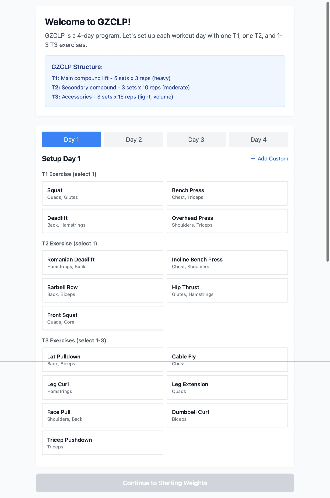

# Workout Tracker

## Overview
```
This application is a workout tracker that I want to use to track my workouts. My goal for this app is to require minimal interactions to plan and track my workouts, and get insights (progressions, rest times, plateaus, deload time, etc).
``` 

## Features
- Customize your workout plan and use progress from last week as a blueprint for the following week.
- Track weights, progress and derive insights.

## Preview
Below is a preview of the application:



## Installation (Dev)
0. Use the devcontainer (or use the compose to attach to the app container)
1. Navigate to the project directory:
   ```bash
   cd workout-app
   ```
2. Install dependencies:
   ```bash
   npm install
   ```

## Usage (Dev)
1. Start the development server:
   ```bash
   npm run dev
   ```
2. Open the application in your browser at the URL provided by the development server.

## Deployment
See `deploy/README.md` for container build/run instructions and zero-downtime rollout guidance. Configurable via env vars (e.g., `PORT`, `DEPLOYMENT_MODE`, secrets injected at runtime). Deployment assets live under `deploy/`.
