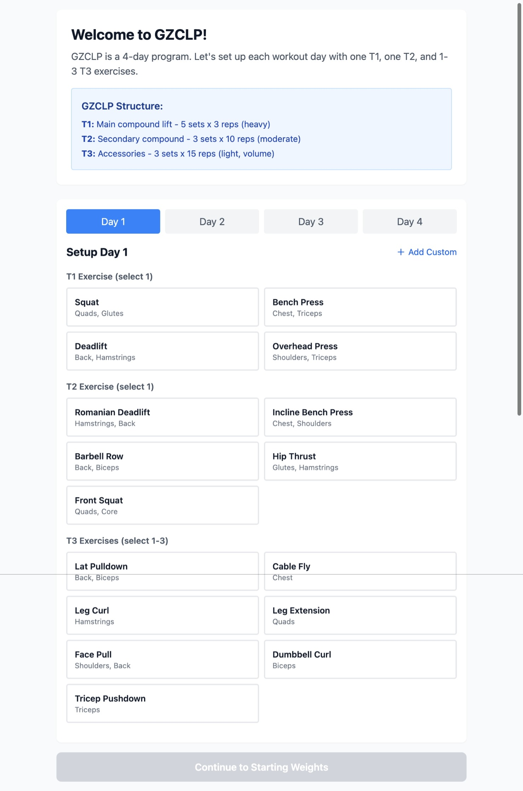

# Workout Tracker

## Overview
```
This application is a workout tracker that I want to use to track my workouts. My goal for this app is to require minimal interactions to plan and track my workouts, and get insights (progressions, rest times, plateaus, deload time, etc).
```

## Features
- Multiple program types: GZCLP weightlifting, ballet, skill practice, cardio, custom
- Track weights, sets, reps, durations, and ballet routines
- Rolling calendar with upcoming sessions
- Cross-device sync with user accounts (optional)
- Anonymous mode — works fully offline with localStorage, just like a static site
- Import/export programs as JSON

## Architecture

The app is a local-first React SPA. Data lives in localStorage and syncs to a backend when signed in.

```
Browser (React + Vite)
  ├── adapter.ts    — storage API (get/set/delete/list)
  ├── local.ts      — localStorage read/write
  ├── sync.ts       — dirty tracking, debounced push/pull
  ├── remote.ts     — API client (Bearer JWT)
  └── oidc.ts       — OIDC authorization code flow (PKCE)
                │
                │ Authorization: Bearer <JWT>
                ▼
Traefik (reverse proxy, routes /api/* and /application/*)
                │
    ┌───────────┴───────────┐
    ▼                       ▼
ASP.NET Core API        Authentik (OIDC IdP)
    │
    ▼
PostgreSQL (user_data + RLS)
```

### Auth modes

| Mode | Sync | Storage | How to enter |
|------|------|---------|--------------|
| **Anonymous** | Off | localStorage only | Click "Try without an account" |
| **Authenticated** | On | localStorage + server | Sign in via Authentik OIDC |

Anonymous users can sign in later — their local data is migrated to the server automatically.

## Preview
Below is a preview of the application:



## Installation (Dev)
0. Use the devcontainer (or use the compose to attach to the app container)
1. Navigate to the project directory:
   ```bash
   cd workout-app
   ```
2. Install dependencies:
   ```bash
   npm install
   ```

## Usage (Dev)
1. Start the development server:
   ```bash
   npm run dev
   ```
2. Open the application in your browser at the URL provided by the development server.

### With full stack (sync + auth)

To develop with the backend, Authentik, and sync enabled:

```bash
# Start the full stack (Traefik, Authentik, API, PostgreSQL)
cd deploy
docker compose up -d

# Set up Authentik OIDC provider (first time only)
bash ../scripts/setup-authentik.sh

# Start the frontend dev server (proxies /api and /application to localhost:80)
cd ..
npm run dev
```

The Vite dev server proxies `/api`, `/application`, and `/.well-known` to `http://localhost` (Traefik on port 80).

## Testing

### E2E Tests (Playwright)
End-to-end tests are written using Playwright and validate all major user flows.

```bash
# Run all tests
npm run test:e2e

# Run tests in UI mode (interactive)
npm run test:e2e:ui

# Run specific test file
npx playwright test e2e/program.spec.ts

# Run tests matching a pattern
npx playwright test --grep "ballet"
```

### Backend Integration Tests
The API has 13 integration tests using xUnit + Testcontainers (real PostgreSQL):

```bash
cd server/server.Tests
dotnet test
```

### Docker-compose Health Checks
Verifies all services start and respond correctly:

```bash
bash scripts/test-docker-compose.sh
```

### Test Artifacts

Two directories are generated during test runs (both are ignored in git):

**`playwright-report/`** - Interactive HTML Dashboard
- Single comprehensive report with all test results
- Includes screenshots, videos, and test timings
- Access via: `npm run test:e2e:report`

**`test-results/`** - Raw Per-Test Artifacts
- One directory per test with screenshots, videos, and traces
- Best for: investigating specific test failures

### Test Coverage
The E2E test suite covers:
- **Auth Gate** (6 tests) — Anonymous mode entry, data persistence, no API calls
- **Ballet** (43 tests) — Setup wizard, routine builder, sessions
- **Program Setup** (4 tests) — Exercise selection, custom exercises, weight entry
- **GZCLP** (3 tests) — Weightlifting program setup and progression
- **Sessions** (3 tests) — Duration-based, skip, weightlifting sets
- **Calendar** (3 tests) — Rolling calendar, scheduling
- **Import/Export** (6 tests) — Program export, import, validation
- **Multi-Program** (2 tests) — Managing multiple program types together
- **OIDC** (5 tests) — Sign-in discovery endpoints, sign-out session clearing

## Deployment
See `deploy/README.md` for full-stack container deployment with Traefik, Authentik, and zero-downtime rollout.

## Project Structure

```
src/
  components/       — React components (App, AuthGate, SyncStatus, Toast, ...)
  storage/
    adapter.ts      — Public storage API (triggers sync when authenticated)
    local.ts        — Raw localStorage operations
    auth.ts         — Auth state management
    oidc.ts         — OIDC authorization code flow with PKCE
    remote.ts       — API client (/api/sync/push, /api/sync/pull)
    sync.ts         — Dirty tracking, debounced push/pull, migration
  types/            — TypeScript type definitions
  utils/            — Utility functions
server/             — ASP.NET Core 8 Minimal API
  Endpoints/        — POST /api/sync/push, GET /api/sync/pull
  Middleware/        — JWT → user resolution + RLS
  Data/             — PostgreSQL schema + connection helper
  server.Tests/     — xUnit integration tests (Testcontainers)
deploy/             — Docker, docker-compose, nginx
scripts/            — Authentik setup, docker-compose test
e2e/                — Playwright E2E tests
```
